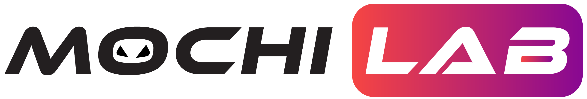

# Ethereum-Harmony Cross-chain Bridge

## Usage

### Ethereum -> Harmony

- ETH -> ONE
- ETH -> Wrapped ETH
- ERC20 -> ONE
- ERC20 -> HRC20
- Wrapped ONE (ERC20) -> ONE

### Harmony -> Ethereum

- ONE -> ETH
- ONE -> Wrapped ONE
- HRC20 -> ERC20
- Wrapped ETH (HRC20) -> ETH
- HRC20 -> ETH

  - BridgeBank.sol
  - BridgeRegistry.sol
  - EthereumBridge.sol
  - Valset.sol

- Main contract in Ethereum:

  - BridgeBank.sol
  - BridgeRegistry.sol
  - HarmonyBridge.sol
  - Valset.sol

## MochiLab

[https://mochilab.org](https://mochilab.org)

## License

@2021 MochiLab
